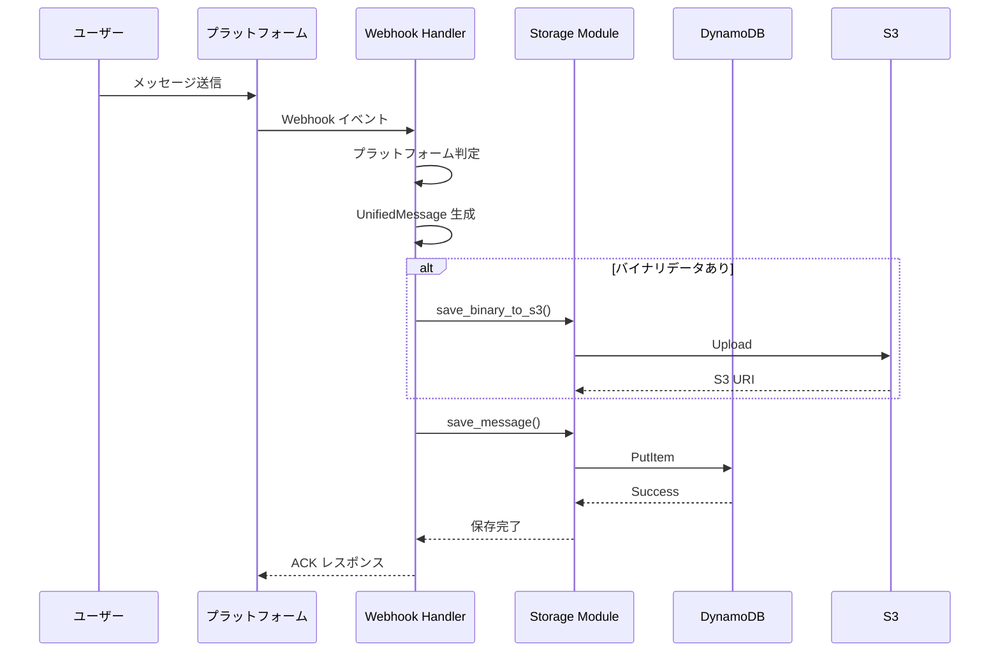

# 📝 トーク履歴記録仕様書 v2

---

## 1. 概要

本仕様書は、マルチプラットフォーム対応チャットボットシステムにおけるメッセージ履歴の保存・管理方法を定義します。

**現在の状況**: ✅ 実装済み

## 2. 対応プラットフォーム

| プラットフォーム | 対応状況 | メッセージ受信単位                                     | ルーム識別キー                          |
| ---------------- | -------- | ----------------------------------------------------- | --------------------------------------- |
| **Custom UI**    | ✅ 実装済み | Web UIからの直接メッセージ                            | `custom:<chatId>`                       |
| **LINE**         | ⚠️ 部分実装 | - 1:1 トーク<br>- グループ<br>- ルーム（複数人トーク） | `line:<userId/groupId/roomId>`          |
| **Slack**        | ⚠️ 部分実装 | - チャンネルメッセージ<br>- DM / グループ DM          | `slack:<channelId>`                     |
| **Teams**        | ⚠️ 部分実装 | - チャネル投稿<br>- グループチャット<br>- 1:1 チャット | `teams:<conversationId>`                |

> ⚠️ LINE/Slack/Teams は Webhook 受信処理は実装済みですが、プラットフォーム認証（Signing Secret 検証等）は未実装です。

## 3. データモデル

### 3.1 ChatHistory テーブル（DynamoDB）

**テーブル名**: `ChatHistory-dev`

| 属性名 | 型 | 説明 | 例 |
| ------ | -- | ---- | -- |
| **PK** | `S` | ルームキー（プラットフォーム:識別子） | `custom:550e8400-e29b-41d4` |
| **SK** | `S` | タイムスタンプ（19桁0パディング） | `0001721212121212000` |
| `role` | `S` | メッセージ送信者の役割 | `user` / `assistant` |
| `contentType` | `S` | コンテンツタイプ | `text` / `image` / `file` |
| `text` | `S` | メッセージテキスト（オプション） | `Podman で BuildKit を有効にする方法は？` |
| `s3Uri` | `S` | S3に保存されたバイナリデータのURI（オプション） | `s3://chat-history-assets-dev/...` |
| `ttl` | `N` | TTL（Unix秒） | `1721298521` |

**TTL設定**: 24時間（86400秒）で自動削除

### 3.2 UnifiedMessage クラス

```python
class UnifiedMessage:
    """全プラットフォーム共通の統一メッセージフォーマット"""
    
    def __init__(
        self,
        platform: str,        # プラットフォーム名（slack、teams、line、custom）
        room_key: str,        # 一意のルーム識別子
        sender_id: str,       # 送信者のID
        ts: int,             # タイムスタンプ（ミリ秒）
        role: str = "user",  # メッセージの役割（user または assistant）
        text: Optional[str] = None,
        content_type: str = "text",
        s3_uri: Optional[str] = None,
    )
```

## 4. メッセージ保存フロー

### 4.1 基本フロー



### 4.2 実装済み機能

1. **メッセージ正規化**: 各プラットフォームからのメッセージを UnifiedMessage 形式に変換
2. **バイナリ処理**: 画像・ファイルは S3 に保存し、メタデータのみ DynamoDB に保存
3. **TTL 管理**: 24時間後に自動削除
4. **ルーム単位管理**: プラットフォーム横断でルーム単位のメッセージ管理

## 5. メッセージ取得

### 5.1 取得API

```python
def get_messages(room_key: str, limit: int = 50) -> List[Dict[str, Any]]:
    """指定されたルームのメッセージ履歴を取得
    
    Args:
        room_key: ルーム識別子
        limit: 取得するメッセージの最大数
        
    Returns:
        メッセージのリスト（新しい順）
    """
```

### 5.2 レスポンス例

```json
{
  "messages": [
    {
      "PK": "custom:550e8400-e29b-41d4",
      "SK": "0001721212121212000",
      "role": "user",
      "contentType": "text",
      "text": "Podman で BuildKit を有効にする方法は？",
      "ttl": 1721298521
    },
    {
      "PK": "custom:550e8400-e29b-41d4",
      "SK": "0001721212121213000",
      "role": "assistant",
      "contentType": "text",
      "text": "Podman で BuildKit を有効にするには...",
      "ttl": 1721298522
    }
  ]
}
```

## 6. プラットフォーム別の実装状況

### 6.1 Custom UI（✅ 完全実装）
- JWT 認証によるセキュアな通信
- リアルタイムメッセージ送受信
- ファイルアップロード対応

### 6.2 LINE（⚠️ 部分実装）
- Webhook 受信処理実装済み
- Channel Secret 検証未実装
- リプライトークン処理実装済み

### 6.3 Slack（⚠️ 部分実装）
- Webhook 受信処理実装済み
- Signing Secret 検証未実装
- スレッド対応（thread_ts）実装済み

### 6.4 Teams（⚠️ 部分実装）
- Webhook 受信処理実装済み
- セキュリティトークン検証未実装
- アダプティブカード対応準備済み

## 7. セキュリティ考慮事項

### 7.1 実装済み
- S3 バケットのアクセス制御
- DynamoDB の最小権限設定
- TTL による自動データ削除

### 7.2 未実装（推奨）
- プラットフォーム別の署名検証
- メッセージの暗号化
- 監査ログ

## 8. パフォーマンス最適化

### 8.1 現在の実装
- DynamoDB オンデマンドモード
- S3 標準ストレージクラス
- 同期処理（レスポンス < 300ms）

### 8.2 将来の最適化案
- DynamoDB プロビジョンドモード（コスト削減）
- S3 Intelligent-Tiering（コスト最適化）
- 非同期処理（EventBridge 経由）

## 9. コスト見積もり

月間 10,000 メッセージの場合：

| コンポーネント | 単価 | 使用量 | 月額 |
| ------------- | ---- | ------ | ---- |
| DynamoDB 書き込み | $1.25/1M WCU | 10K writes | ~$0.01 |
| DynamoDB 読み取り | $0.25/1M RCU | 50K reads | ~$0.01 |
| S3 ストレージ | $0.023/GB | 1GB | ~$0.02 |
| S3 リクエスト | $0.0004/1K PUT | 1K uploads | ~$0.001 |
| **合計** | | | **~$0.04** |

## 10. 今後の拡張予定

### 10.1 機能拡張
- [ ] ベクトル化によるセマンティック検索
- [ ] メッセージの要約・分析
- [ ] 会話コンテキストの AI 活用

### 10.2 プラットフォーム拡張
- [ ] Discord 対応
- [ ] WhatsApp Business 対応
- [ ] カスタム Webhook 対応

---

*最終更新: 2024年12月*
