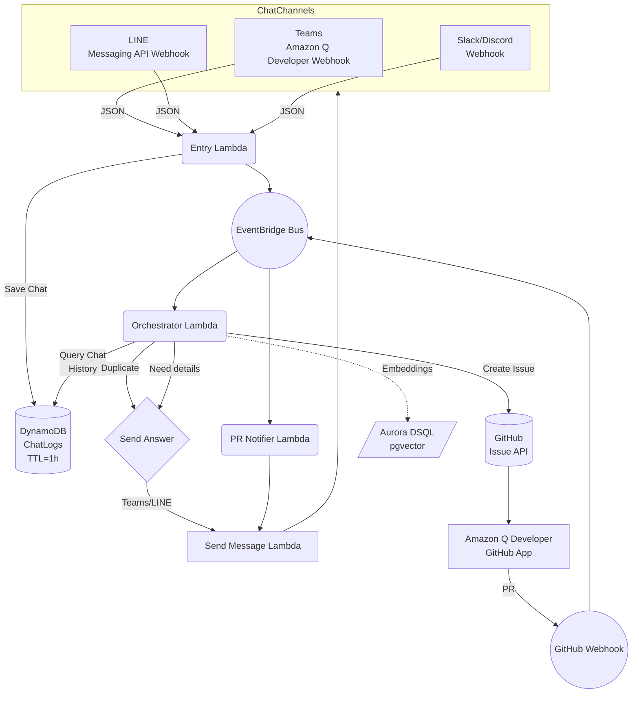

# チャットボット自動 Issue→修正→PR 通知 **詳細設計書**

> **Version:** 1.0  > **Last‑update:** 2025‑07‑14  > **Author:** ChatGPT o3

---

## 1. ゴール & 非機能要件

| 項目         | 内容                                                                                                                                     |
| ------------ | ---------------------------------------------------------------------------------------------------------------------------------------- |
| ゴール       | Teams / LINE で受付けた問い合わせを **自動で GitHub Issue に変換 → Amazon Q Developer が修正 → PR 作成 → チャット通知** まで無人化する。 |
| MTTR         | 90 % の問い合わせを 2 分以内に既存回答 or 新規 Issue 登録完了                                                                            |
| 可用性       | RPO=0、RTO<5 分（リージョン障害時は設定済み DR 手順で東京→大阪へ切替）                                                                   |
| コスト       | 月 ≈ ¥2,000（チャット 5k / PR 500 件規模、Aurora DSQL 0 ACU モード採用時）                                                               |
| セキュリティ | - IAM 最小権限、KMS カスタマーマスターキー<br>- GitHub App JWT を Secrets Manager へ格納                                                 |

---

## 2. 全体アーキテクチャ（論理）



---

## 3. リソース別詳細設計

### 3.1 チャネル連携関連

| ID   | リソース                       | 種別／SKU | 役割                                                            | スケーリング | セキュリティ                                        |
| ---- | ------------------------------ | --------- | --------------------------------------------------------------- | ------------ | --------------------------------------------------- |
| CH‑T | **Amazon Q Developer (Teams)** | SaaS App  | Teams メッセージを Webhook + SIGv4 でイベント配信               | SaaS自動     | IAM ロール per チャネル (送信権限のみ)              |
| CH‑L | **LINE Messaging API**         | Webhook   | LINE ボット受付。API Gateway HTTP + Lambda URL がエンドポイント | Lambda Auto  | X-LINE-Signature 検証。IP 制御不可能なので WAF 使用 |

### 3.2 入力レイヤ

| ID     | リソース                     | 仕様                        | 主要環境変数            | 備考                                          |
| ------ | ---------------------------- | --------------------------- | ----------------------- | --------------------------------------------- |
| API‑GW | **API Gateway HTTP v2**      | 1 ステージ、IAM Auth 無し   | —                       | 末端が Lambda URL で簡素化                    |
| ENTR   | **AWS Lambda** (`entry-fn`)  | Python 3.12 / 128 MB / 30 s | `EVENT_BUS=chatops-bus` | Teams と LINE で Use‑case 切替                |
| EB     | **EventBridge (custom bus)** | 名前: `chatops-bus`         | —                       | ルール: `source in ['teams','line','github']` |

### 3.3 コア処理

| ID      | リソース                             | 仕様                        | 役割                                                                                                                                       | 主要 IAM                                                                                               |
| ------- | ------------------------------------ | --------------------------- | ------------------------------------------------------------------------------------------------------------------------------------------ | ------------------------------------------------------------------------------------------------------ |
| ORC     | **AWS Lambda** (`orchestrator-fn`)   | Python 3.12 / 512 MB / 60 s | - Bedrock Haiku で意図分類<br>- 欠落フィールド抽出<br>- pgvector で重複検索<br>- DynamoDB にドラフト状態保存 / 更新<br>- GitHub Issue POST | `bedrock:InvokeModel`, `dynamodb:*`, `rds-data:*`, `secretsmanager:GetSecretValue`, `events:PutEvents` |
| VEC     | **Aurora DSQL Serverless v2**        | PostgreSQL 15 / 0‑4 ACU     | - `faq_embeddings` テーブル (pgvector 1536d)<br>- KNN 検索 (`<=>` operator)<br>- Data API 経由呼び出し                                     | VPC Subnet = Private<br>0 ACU 停止 after 5 min idle                                                    |
| BED‑EMB | **Bedrock Titan Text Embeddings V2** | On‑demand API               | チャット本文をベクトル化                                                                                                                   | —                                                                                                      |
| DDB     | **DynamoDB** (single‑table)          | On‑Demand                   | - チャットログ & Draft & Meta & Counter<br>- `ChatLogs` パーティション（PK=`<platform>#<channelId>`, SK=`<epoch_ms>`）<br>- TTL=1時間（`expiresAt`フィールド） | Streams → Kinesis Firehose to S3                                                                       |

### 3.4 GitHub 連携

| ID     | リソース                          | 仕様                      | 役割                                       | セキュリティ                    |
| ------ | --------------------------------- | ------------------------- | ------------------------------------------ | ------------------------------- |
| GH‑APP | **Amazon Q Developer GitHub App** | SaaS                      | ラベル付で自動 clone → 修正 → PR           | インストール範囲 = 指定リポのみ |
| GH‑JWT | **Secrets Manager secret**        | `/chatops/github/jwt-key` | GH App の PEM。ORC が 10 min 毎に JWT 生成 | KMS CMK で暗号化                |
| GH‑WH  | **GitHub Webhook**                | pull_request, issue      | EventBridge SaaS 連携                      | HMAC 検証は自動                 |

### 3.5 出力レイヤ

| ID   | リソース                     | 仕様                 | 役割                                            | 備考                       |
| ---- | ---------------------------- | -------------------- | ----------------------------------------------- | -------------------------- |
| NOTI | **AWS Lambda** (`notify-fn`) | Python 3.12 / 128 MB | PR イベントをチャネルごとの送信 API に変換      | —                          |
| SEND | **AWS Lambda** (`send-fn`)   | Node 20 / 128 MB     | Teams → `POST /messages`, LINE → `replyMessage` | トークンは Secrets Manager |

### 3.6 補助リソース

| リソース                | 用途                                          | 詳細                                            |
| ----------------------- | --------------------------------------------- | ----------------------------------------------- |
| **S3 `chatops-config`** | 必須フィールド YAML, CloudFormation templates | `required-fields.yaml`, `cdk.context.json`      |
| **AWS CDK App**         | IaC                                           | `cdk deploy --context stage=prod`               |
| **CloudWatch Alarms**   | 監視                                          | Lambda Error ≥ 5 /5 min, Aurora ACU ≥ 2 for 1 h |

---

## 4. データフロー詳細

### 4.1 重複質問検知シーケンス

1. ENTR から渡った ChatEvent → ORC
2. ORC: `bedrock:InvokeModel(Classify)` ⇒ `intent=ISSUE_CREATE`
3. ORC: Titan Embeddings → pgvector KNN
4. `score ≥ 0.85` → NOTI へ「既存回答」イベント → SEND
5. 新規時のみ GitHub Issue 作成。ベクトルと URL を `faq_embeddings` に `INSERT`

### 4.2 不足フィールド補完

* ORC が `missing=['steps','expected']` を検出したら

  1. `Draft Item` を `UpdateItem` (`status=pending_details`)
  2. SEND 経由で「再現手順と期待値を教えて」とチャットに投稿
  3. 24 h 後 `ConditionExpression` でまだ欠落 → PRNoti でクローズ勧告

### 4.3 1時間限定メモリ処理シーケンス

1. ENTR が受信メッセージを DynamoDB `ChatLogs` に保存
   ```
   PK = <platform>#<channelId>
   SK = <epoch_ms>
   message = <message_text>
   sender = <user_id>
   expiresAt = now + 3600s   // TTL
   ```

2. ORC が応答生成前に直近履歴を Query
   ```
   PK = <current_platform>#<current_channel>
   SK > now - 3600000   // 過去1時間
   ```

3. 取得したチャット履歴を Bedrock コンテキストに追加

4. TTL により 1時間後に自動削除
   * 長時間セッション対応として `expiresAt` 延長機能
   * 重要会話は `isPinned=true` フラグで TTL 適用外に設定可能

---

## 5. スケーリング & 信頼性

| レイヤ               | スケール方式      | 最大想定 TPS             |
| -------------------- | ----------------- | ------------------------ |
| API Gateway / Lambda | 同時実行 Auto     | 50 req/s (LINE burst)    |
| EventBridge Bus      | ストア&フォワード | 100 TPS                  |
| Aurora DSQL          | 0‑4 ACU Auto B    | ≈ 500 QPS (pgvector KNN) |
| DynamoDB             | On‑Demand         | 1,000 RPS / table (自動) |

* **障害時**: Aurora failover to reader, Lambdas retry<br>- **Deploy**: Blue/Green (Lambda Versions + weighted alias)

---

## 6. IAM & Least Privilege (要約)

| Role                | Allow                           | Resource                                   | Condition                                         |
| ------------------- | ------------------------------- | ------------------------------------------ | ------------------------------------------------- |
| `entry-fn-role`     | `events:PutEvents`              | `arn:aws:events:*:*:event-bus/chatops-bus` | —                                                 |
| `orchestrator-role` | `bedrock:InvokeModel`           | `*`                                        | `aws:RequestedRegion = ap-northeast-1`<br>and TLS |
|                     | `rds-data:*`                    | `arn:aws:rds-data:*:*:cluster:chatops-*`   | PrincipalTag `dept=devops`                        |
|                     | `dynamodb:*`                    | `arn:aws:dynamodb:*:*:table/chatops-*`     | —                                                 |
| `send-fn-role`      | `secretsmanager:GetSecretValue` | LINE/Teams token                           | kms:ViaService= lambda.*                        |

---

## 7. コスト内訳シミュレーション (Tokyo)

| カテゴリ           | 月間利用量              | 単価           | 月額         |
| ------------------ | ----------------------- | -------------- | ------------ |
| Titan Embedding    | 100 k Token             | $0.00002 /Tok | ¥300         |
| Bedrock Haiku      | 300 k in + 60 k out Tok | $0.00025 /in  | ¥900         |
| Lambda             | 6 M req・128 MB/100 ms  | see calc       | ¥250         |
| Aurora DSQL        | 0 ACU idle + 20 h 1 ACU | $0.12 /ACU‑h  | ¥360         |
| DynamoDB           | 20 k RCUs + WCUs        | on‑demand      | ¥60          |
| Misc (EB, S3, CWL) | —                       | —              | ¥120         |
| **合計**           |                         |                | **≈ ¥1,990** |

---

## 8. 運用フロー

| イベント                   | 担当    | Runbook                                                                                  |
| -------------------------- | ------- | ---------------------------------------------------------------------------------------- |
| **Lambda Error Alarm**     | DevOps  | 1) CloudWatch Log Insight で stacktrace 取得 → 2) Hotfix → 3) `cdk deploy -c stage=prod` |
| **Aurora ACU Spike**       | DBA     | 1) `rds-data` slow query log確認 → 2) pgvector index追加 or ACU 上限 8 に変更            |
| **GitHub PR 失敗コメント** | ChatBot | Bot が `/retry` コマンド受付 → Q Developer 再実行                                        |

---

## 9. 今後の拡張候補

1. **OpenTelemetry SDK** で全 Lambda を分散トレース化
2. **Slack/Discord Adapter** を ENTR に追加 (構造同一)
3. **CodeBuild Integration** ── PR 完了時に E2E テスト＆Preview 環境を churn
4. **1時間メモリの拡張** ── Bedrock Agent Memory や Amazon Kendra との連携
5. **カスタムメモリ期間設定** ── チャネル・プロジェクトごとにメモリ保持期間を可変設定

---

© 2025 Kyouhei Kawanishi / ChatGPT o3
