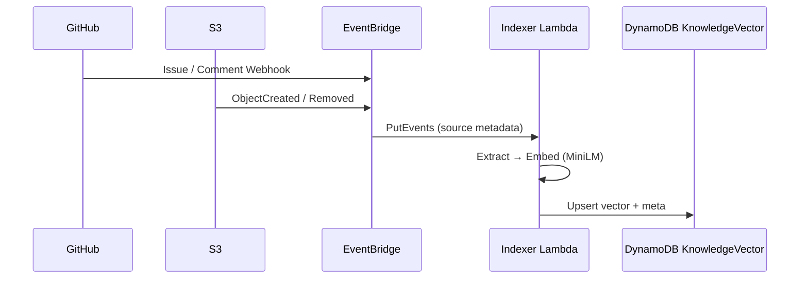
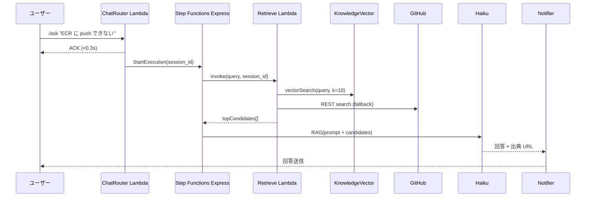

# 📄 既存情報調査仕様書 v2 – GitHub Issue / S3 ドキュメント連携

---

## 1. 目的
AI ボットがユーザーからの問い合わせ（/ask, /質問 など）を受信した際、過去のナレッジ（GitHub Issue、S3 に格納された設計書・FAQ など）を即時検索し、**既に解決策が存在する場合は再回答を防ぎ、迅速な自己解決**を促すことを目的とする。

**現在の状況**: ❌ 未実装（将来実装予定）

## 2. スコープ
* プラットフォーム: LINE, Slack, Teams, Custom UI（初期設計書 §3 参照）
* **マルチボット運用**: 単一システム内で Bot A / Bot B ... を同居させ、各ボットごとに **参照可能ソース（GitHub リポジトリ / S3 パス）と Issue 起票先** を個別設定できる。
* データソース:
  * GitHub Issue: Private/Public 複数リポジトリ対応（ボットごとにホワイトリスト設定）
  * S3 ドキュメント: Markdown / PDF / Office / テキスト（ボットごとに `s3://bucket/prefix` 単位で制御）
* サポート言語: 日本語 / 英語（自動判定 → 和訳・英訳は Haiku に同時依頼）

## 3. 実装状況と前提条件

### 3.1 実装済みコンポーネント
- ✅ マルチボット管理システム（ChatbotSettingsDB）
- ✅ ユーザー認証・権限管理
- ✅ チャット履歴保存（ChatHistory）
- ✅ S3 バイナリデータ保存

### 3.2 未実装コンポーネント（本仕様の対象）
- ❌ GitHub API 連携
- ❌ ベクトル検索（DynamoDB Vector Search）
- ❌ AI 連携（Bedrock Claude）
- ❌ インデクサー Lambda
- ❌ EventBridge / Step Functions
- ❌ コマンド処理（/ask, /質問等）

## 4. データソース詳細（設計）
### 4.1 GitHub Issue
| 項目 | 内容 |
| ---- | ---- |
| 対象 | **Bot 設定**で許可されたリポジトリのみ（ChatbotSettingsDB に保存） |
| 取得方法 | **GitHub REST v3** `GET /repos/:owner/:repo/issues`（state=open/closed 両方） |
| 抽出フィールド | `title`, `body`, `comments`（最新 3 件）, `labels`, `html_url`, `state`, `closed_at` |
| 同期トリガー | 1. GitHub Webhook (`issues`, `issue_comment`)<br>2. 毎時の差分クローラ（バックアップ） |
| ベクトル化 | MiniLM (768 次元) で `title + body + comments` をエンコード |
| ストレージ | 新規テーブル `KnowledgeVector`（**PK=`bot#<id>#source#gh`**） |

### 4.2 S3 ドキュメント
| 項目 | 内容 |
| ---- | ---- |
| バケット | `chatbot-knowledge-prod`（環境変数 `KNOWLEDGE_BUCKET`） |
| サポート形式 | `.md`, `.txt`, `.pdf`, `.docx`, `.pptx`（PDF/Text 自動抽出） |
| 取得方法 | **S3 イベント** (`ObjectCreated`, `ObjectRemoved`) を EventBridge へ転送 |
| 抽出フィールド | ファイルパス, ファイル名, 抽出テキスト, `last_modified` |
| ベクトル化 | 同上 MiniLM |
| ストレージ | 新規テーブル `KnowledgeVector`（**PK=`bot#<id>#source#s3`**） |

## 5. 必要な新規テーブル設計

### 5.1 KnowledgeVector テーブル（未実装）
| 属性名 | 型 | 説明 |
| ------ | -- | ---- |
| **PK** | `S` | `bot#<botId>#source#<type>` |
| **SK** | `S` | `doc#<documentId>` |
| `vector` | `L` | 768次元ベクトル（数値リスト） |
| `source_type` | `S` | `github` / `s3` |
| `title` | `S` | ドキュメントタイトル |
| `content` | `S` | 抽出されたテキスト（最大4KB） |
| `url` | `S` | 元ドキュメントのURL |
| `metadata` | `M` | その他メタデータ（labels, state等） |
| `indexed_at` | `S` | インデックス日時 |
| `ttl` | `N` | TTL（オプション） |

## 6. インデクシング & 更新フロー（設計）

* **再試行**: Idx Lambda は失敗時 DLQ へ送信し、再処理ジョブで 3 回リトライ。
* **削除**: `ObjectRemoved` または Issue `deleted` は KV から物理削除。

## 7. 問い合わせ時の検索フロー（設計）

* **vectorSearch**: DynamoDB Vector Search, `top_k=10`, スコア閾値 `>=0.8`。
* **fallback**: ベクトル一致が低い場合、GitHub `search/issues` をキーワード検索。

## 8. 実装に必要な追加コンポーネント

### 8.1 新規 Lambda 関数
1. **Indexer Lambda**
   - GitHub/S3 イベントを受信
   - テキスト抽出とベクトル化
   - KnowledgeVector テーブルへの保存

2. **Retrieve Lambda**
   - ベクトル検索の実行
   - GitHub API フォールバック
   - 検索結果のランキング

3. **Notifier Lambda**
   - AI 生成回答の送信
   - プラットフォーム別フォーマット

### 8.2 Step Functions ワークフロー
```yaml
StateMachine:
  StartAt: ParseCommand
  States:
    ParseCommand:
      Type: Task
      Resource: ChatRouter Lambda
      Next: CheckCommand
    
    CheckCommand:
      Type: Choice
      Choices:
        - Variable: $.command
          StringEquals: ask
          Next: RetrieveKnowledge
      Default: DirectResponse
    
    RetrieveKnowledge:
      Type: Task
      Resource: Retrieve Lambda
      Next: GenerateAnswer
    
    GenerateAnswer:
      Type: Task
      Resource: Bedrock Claude
      Next: SendResponse
    
    SendResponse:
      Type: Task
      Resource: Notifier Lambda
      End: true
```

## 9. セキュリティ & 権限（追加分）
| 項目 | 対応 |
| ---- | ---- |
| GitHub | Bot GitHub App の `issues:read` のみ付与。`contents:read` は不要。 |
| S3 | Indexer Lambda に `s3:GetObject`, `s3:ListBucket` を付与。バケットポリシーで IP 制限可。 |
| DynamoDB | `KnowledgeVector` テーブルに対する `Query`, `PutItem`, `DeleteItem`. |
| Bedrock | `bedrock:InvokeModel` for Claude 3.5 Haiku |
| Secrets | GitHub App Token は `AWS Secrets Manager` で管理 |

## 10. コスト試算（追加分）
| コンポーネント | 単価 | 月次トラフィック前提 | 月額目安 |
| -------------- | ---- | ------------------- | -------- |
| Indexer Lambda | $0.20 / 1M req | 1000 events | <$1 |
| DynamoDB KV 読み書き | 25 RCUs / 5 WCUs | 100K ops | ~$3 |
| Vector Search | $0.20 per 1M queries | 30K queries | ~$6 |
| Step Functions | $0.025 per 1K transitions | 10K flows | ~$0.25 |
| Bedrock Haiku | $0.25/$1.25 per 1M tokens | 50K queries | ~$15 |
| **合計追加** | | | **≈ $25** |

## 11. 実装ロードマップ

### Phase 1: 基盤構築（1-2週間）
- [ ] KnowledgeVector テーブル作成
- [ ] Indexer Lambda 基本実装
- [ ] EventBridge ルール設定
- [ ] S3 イベント連携

### Phase 2: 検索機能（2-3週間）
- [ ] ベクトル化処理実装（MiniLM）
- [ ] Retrieve Lambda 実装
- [ ] DynamoDB Vector Search 統合
- [ ] GitHub API 連携

### Phase 3: AI 統合（2週間）
- [ ] Bedrock 接続設定
- [ ] Step Functions ワークフロー
- [ ] プロンプトエンジニアリング
- [ ] Notifier Lambda 実装

### Phase 4: コマンド処理（1週間）
- [ ] コマンドパーサー実装
- [ ] 多言語対応（日英）
- [ ] エラーハンドリング

### Phase 5: テスト・最適化（1-2週間）
- [ ] 統合テスト
- [ ] パフォーマンスチューニング
- [ ] コスト最適化
- [ ] ドキュメント整備

## 12. 移行計画

### 12.1 既存データの活用
- ChatHistory のメッセージをベクトル化して学習データとして活用
- ChatbotSettingsDB のボット設定に GitHub/S3 設定を追加

### 12.2 段階的ロールアウト
1. 特定のボットでベータテスト
2. 検索精度の評価とチューニング
3. 全ボットへの展開

---

### 参考
* 初期設計書 §3 アーキテクチャ, §4 データモデル, §5 フロー概要
* [GitHub REST API](https://docs.github.com/en/rest/issues/issues)
* [AWS Bedrock Claude Documentation](https://docs.aws.amazon.com/bedrock/)
* [DynamoDB Vector Search](https://aws.amazon.com/blogs/database/introducing-amazon-dynamodb-zero-etl-integration-with-amazon-opensearch-service/) 