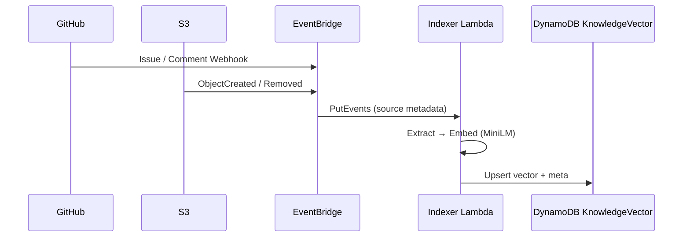
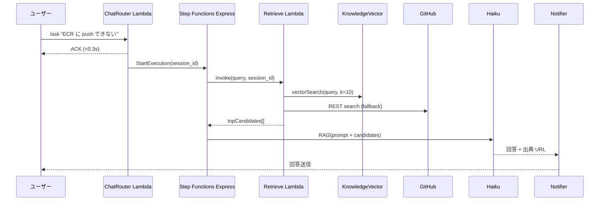

# 📄 既存情報調査仕様書 v1 – GitHub Issue / S3 ドキュメント連携

---

## 1. 目的
AI ボットがユーザーからの問い合わせ（/ask, /質問 など）を受信した際、過去のナレッジ（GitHub Issue、S3 に格納された設計書・FAQ など）を即時検索し、**既に解決策が存在する場合は再回答を防ぎ、迅速な自己解決**を促すことを目的とする。

## 2. スコープ
* プラットフォーム: LINE, Slack, Teams（初期設計書 §3 参照）
* **マルチボット運用**: 単一システム内で Bot A / Bot B ... を同居させ、各ボットごとに **参照可能ソース（GitHub リポジトリ / S3 パス）と Issue 起票先** を個別設定できる。
* データソース:
  * GitHub Issue: Private/Public 複数リポジトリ対応（ボットごとにホワイトリスト設定）
  * S3 ドキュメント: Markdown / PDF / Office / テキスト（ボットごとに `s3://bucket/prefix` 単位で制御）
* サポート言語: 日本語 / 英語（自動判定 → 和訳・英訳は Haiku に同時依頼）

## 3. データソース詳細
### 3.1 GitHub Issue
| 項目 | 内容 |
| ---- | ---- |
| 対象 | **Bot 設定ファイル**で許可されたリポジトリのみ（例: BotA ➜ repo1, repo2 / BotB ➜ repo1, repo3） |
| 取得方法 | **GitHub REST v3** `GET /repos/:owner/:repo/issues`（state=open/closed 両方） |
| 抽出フィールド | `title`, `body`, `comments`（最新 3 件）, `labels`, `html_url`, `state`, `closed_at` |
| 同期トリガー | 1. GitHub Webhook (`issues`, `issue_comment`)<br>2. 毎時の差分クローラ（バックアップ） |
| ベクトル化 | MiniLM (768 次元) で `title + body + comments` をエンコード |
| ストレージ | `KnowledgeVector` テーブル（**PK=`bot#<id>#source#gh`**） |

### 3.2 S3 ドキュメント
| 項目 | 内容 |
| ---- | ---- |
| バケット | `chatbot-knowledge-prod`（環境変数 `KNOWLEDGE_BUCKET`） |
| サポート形式 | `.md`, `.txt`, `.pdf`, `.docx`, `.pptx`（PDF/Text 自動抽出） |
| 取得方法 | **S3 イベント** (`ObjectCreated`, `ObjectRemoved`) を EventBridge へ転送 |
| 抽出フィールド | ファイルパス, ファイル名, 抽出テキスト, `last_modified` |
| ベクトル化 | 同上 MiniLM |
| ストレージ | `KnowledgeVector` テーブル（**PK=`bot#<id>#source#s3`**） |

## 4. インデクシング & 更新フロー

* **再試行**: Idx Lambda は失敗時 DLQ へ送信し、再処理ジョブで 3 回リトライ。
* **削除**: `ObjectRemoved` または Issue `deleted` は KV から物理削除。

## 5. 問い合わせ時の検索フロー

* **vectorSearch**: DynamoDB Vector Search, `top_k=10`, スコア閾値 `>=0.8`。
* **fallback**: ベクトル一致が低い場合、GitHub `search/issues` をキーワード検索。

## 6. スコアリング & 採択ロジック
1. 各候補に対し `similarity_score` を取得。
2. Haiku へは `top 3` の本文 + メタ（URL, state）をシステムプロンプトに注入。
3. Haiku に **「回答が既存情報で十分か？」** を判定させ、`coverage=true` のとき:
   * 既存 Issue or Doc の URL と共に"既知の解決策"を回答。
   * 新規 Issue 化フロー（初期設計 §5-4 参照）はスキップ。
4. `coverage=false` の場合は従来どおり調査・PR 生成フェーズへ。

## 7. フロントエンド表示ルール
* 回答末尾に `🔗 Related: <title> (#123)` や `📄 Doc: S3/faq/docker.md` を自動挿入。
* クリックでブラウザ / モバイルアプリが該当 URL を開く。
* 会話 UI 側への追加改修は不要（Markdown リンク対応済み）。

## 8. セキュリティ & 権限
| 項目 | 対応 |
| ---- | ---- |
| GitHub | Bot GitHub App の `issues:read` のみ付与。`contents:read` は不要。 |
| S3 | Indexer Lambda に `s3:GetObject`, `s3:ListBucket` を付与。バケットポリシーで IP 制限可。 |
| DynamoDB | `KV` テーブルに対する `Query`, `PutItem`, `DeleteItem`. |
| Secrets | GitHub App Token, Bedrock API Key は `AWS Secrets Manager`. |

## 9. コスト試算（追加分）
| コンポーネント | 単価 | 月次トラフィック前提 | 月額目安 |
| -------------- | ---- | ------------------- | -------- |
| Indexer Lambda | $0.20 / 1M req | 1000 events | <$1 |
| DynamoDB KV 読み書き | 25 RCUs / 5 WCUs | 100K ops | ~$3 |
| Vector Search | $0.20 per 1M queries | 30K queries | ~$6 |
| **合計追加** | | | **≈ $10** |

## 10. 運用 & 監視
* **メトリクス**: Indexer Lambda `Duration` / `Errors`, KV `SuccessfulRequestLatency`。
* **アラート**: CloudWatch Alarm → SNS → Slack `#bot-alerts`。
* **データ品質**: 月次バッチでランダム 5% 件のベクトル→原文復元クロスチェック。
* **削除ポリシー**: Issue が `locked` かつ `closed` 1 年経過で自動 TTL（Glacier 移行）。

## 11. マルチボット運用設計

### 11.1 Bot 設定ファイル (`bot-config.yaml`)
```yaml
bots:
  - id: botA
    display_name: "開発チームサポートBot"
    github_repos:
      - org1/repo1
      - org1/repo2
    s3_sources:
      - bucket: chatbot-knowledge-prod
        prefix: folder1/
      - bucket: chatbot-knowledge-prod
        prefix: folder2/
    issue_post_repo: org1/repo1   # 既存 Issue へコメント / 新規起票
  - id: botB
    display_name: "運用チームサポートBot"
    github_repos:
      - org1/repo1
      - org1/repo3
    s3_sources:
      - bucket: chatbot-knowledge-prod
        prefix: folder2/
      - bucket: chatbot-knowledge-prod
        prefix: folder3/
    issue_post_repo: org1/repo3
```
* **ホットリロード**: `bot-config.yaml` は S3 に置き、ChatRouter が 5 分おきにキャッシュ更新。

### 11.2 インデクサの拡張
1. GitHub / S3 イベント受信時、`bot-config` を参照し **対象ボットの集合** を求める。
2. 対象ボットごとに **KnowledgeVector へ個別 Upsert**（`PK=bot#<id>#source#...`）。
3. これにより **同じドキュメントでも複数ボット用に重複登録**。

### 11.3 検索時のフィルタ
Retrieve-Lambda は `session.bot_id` を引数に取り、
```sql
SELECT * FROM KnowledgeVector
WHERE PK = 'bot#{bot_id}#source#*'
ORDER BY vector_similarity(query)
LIMIT 10;
```
でボット専用ナレッジのみを検索。

### 11.4 Issue 起票ロジック
* 回答不足時の自動 Issue 化は `bot-config.issue_post_repo` を使用。
* 既存 Issue コメント追加時も同様にリポジトリを限定。

### 11.5 セキュリティ分離
| 項目 | 分離策 |
| ---- | ------ |
| GitHub Token | Bot ごとに GitHub App Installation ID を分離し、アクセス権を制限。 |
| DynamoDB KV | `bot_id` プレフィックスでテナント分離し、IAM policy `Condition -> begins_with(PK, "bot#${aws:PrincipalTag}")` を適用。 |
| S3 | インデクサ Lambda は `prefix` 限定 IAM ポリシーでアクセス。 |

### 11.6 コストへの影響
* 同一ドキュメントを複数ボットに登録するため **ベクトル件数が N 倍**。<br>例: 3 ボット × 1 万 Doc = 3 万行。Vector Search 読み込みは O(ボット数)。

---

### 参考
* 初期設計書 §3 アーキテクチャ, §4 データモデル, §5 フロー概要
* [GitHub REST API](https://docs.github.com/en/rest/issues/issues) 